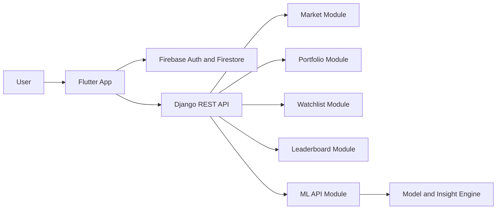

# Stock Simulator India PPT Content Guide

This file is made for copy-paste into your PPT slides.

The presentation style should feel like a product review or office meeting presentation:

- less theory
- more system flow
- more visuals
- short code snippets from multiple important files
- clear architecture
- professional wording

## Suggested PPT Flow

Recommended slide count: 12 to 15 slides

## Slide 1: Title Slide

**Title**

Stock Simulator India

**Subtitle**

A full-stack paper trading platform for learning stock market behavior without real financial risk

**Add**

- Your name
- Department / class
- Guide / professor name
- Date

**Visual idea**

- App screenshot as background or on right side
- Small icons for Flutter, Django, Firebase, and ML

## Slide 2: Problem Statement

**Title**

Problem Statement

**Slide text**

Many students and beginner investors want to understand stock trading, portfolio behavior, and market movement, but practicing in the real market involves financial risk.

There is a need for a safe learning platform where users can:

- observe stock movement
- practice buying and selling
- track portfolio performance
- build market understanding
- explore prediction-based insights

**Presenter note**

This wording is neutral and does not compare or attack other projects.

## Slide 3: Objective

**Title**

Project Objective

**Slide text**

The objective of Stock Simulator India is to build a realistic paper trading platform that combines:

- a user-friendly application interface
- market and portfolio simulation
- backend API integration
- watchlist and leaderboard features
- ML-based stock insight support
- Firebase-based authentication and profile storage

## Slide 4: Proposed Solution

**Title**

Proposed Solution

**Slide text**

Stock Simulator India provides a virtual trading environment where users can:

- register and log in securely
- view Indian stock market data
- explore stock details and price movement
- place virtual buy and sell orders
- monitor holdings and profit/loss
- manage a personal watchlist
- compare performance through leaderboard
- view prediction and recommendation insights from the ML layer

**Visual idea**

Use 6 to 8 icons in a grid:

- Login
- Market
- Stock Details
- Buy/Sell
- Portfolio
- Watchlist
- Leaderboard
- ML Insights

## Slide 5: Technology Stack

**Title**

Technology Stack

**Slide text**

**Frontend**

- Flutter
- Riverpod
- go_router
- Dio

**Backend**

- Django
- Django REST Framework
- SQLite

**Authentication and Cloud**

- Firebase Auth
- Cloud Firestore

**Machine Learning**

- Python
- pandas
- scikit-learn
- joblib

**Visual idea**

Make this slide as a 4-column stack table with logos.

## Slide 6: System Architecture

**Title**

System Architecture

**Slide text**

The project follows a hybrid full-stack architecture:

- Flutter handles UI, navigation, and user interaction
- Firebase manages authentication and user profile storage
- Django provides APIs and simulator business logic
- ML module generates stock prediction and recommendation insights

## System Architecture Visual

You can directly recreate this as a diagram in PPT:

```text
                +-----------------------------+
                |         User / Viewer       |
                +--------------+--------------+
                               |
                               v
                +-----------------------------+
                |      Flutter Application    |
                | UI, Navigation, State, UX   |
                +------+-----------+----------+
                       |           |
          Auth/Profile |           | API Calls
                       v           v
          +----------------+   +----------------------+
          |   Firebase     |   |    Django Backend    |
          | Auth + Profile |   | Business Logic + API |
          +----------------+   +----+-----+-----+-----+
                                     |     |     |
                                     v     v     v
                                +-------+ +-------+ +---------+
                                |Market | |Trade  | |Watchlist|
                                +-------+ +-------+ +---------+
                                     |
                                     v
                               +-------------+
                               |   ML Layer  |
                               | Prediction  |
                               | Recommend   |
                               +-------------+
```

If your PPT supports Mermaid through any plugin or external converter, use this:



## Slide 7: Main Modules

**Title**

Main Modules

**Slide text**

The system is divided into the following major modules:

- Authentication
- Home dashboard
- Market overview
- Stock details
- Portfolio management
- Transaction history
- Watchlist
- Leaderboard
- Settings
- ML prediction and recommendation

**Visual idea**

Use a tiled dashboard-style layout with screenshots beside module names.

## Slide 8: Working Flow

**Title**

Application Workflow

**Slide text**

1. User opens the application.
2. Splash screen loads.
3. User logs in or registers.
4. Firebase creates and verifies the user account.
5. Firestore stores user profile details.
6. Django syncs the user and serves market and portfolio APIs.
7. User explores stocks and performs virtual buy or sell operations.
8. Portfolio, watchlist, and leaderboard update accordingly.
9. ML endpoints provide stock insight and recommendation support.

**Visual idea**

Use a horizontal process flow with arrows.

## Slide 9: Screenshots to Add

**Title**

Interface Demonstration

**Add screenshots of**

- Login page
- Register page
- Home dashboard
- Market page
- Stock details page
- Portfolio page
- Watchlist page
- Leaderboard page
- Firebase Authentication screen
- Firestore user collection

**How to arrange**

- 2 screenshots per slide
- Keep one caption line under each image
- Example caption: "Stock details page with chart and ML insight card"

**Best visuals for office-meeting audience**

- clean screenshots
- zoom in on important panels
- do not use too many tiny screenshots on one slide

## Slide 10: Firebase Integration

**Title**

Firebase Integration

**Slide text**

Firebase is used for:

- email and password based authentication
- storing app-side user profile data in Firestore
- supporting a simple and practical registration flow

**Suggested screenshot**

- Firebase Authentication users list
- Firestore collection showing stored user profile fields

## Slide 11: Backend API Design

**Title**

Backend API Design

**Slide text**

The Django backend is responsible for:

- market data endpoints
- portfolio summary and transaction handling
- watchlist operations
- leaderboard ranking data
- registration sync
- ML prediction and recommendation endpoints

**Important API groups**

- `/api/users/`
- `/api/market/`
- `/api/portfolio/`
- `/api/watchlist/`
- `/api/leaderboard/`
- `/api/ml/`

## Slide 12: Machine Learning Integration

**Title**

Machine Learning Integration

**Slide text**

The ML module adds analytical value to the simulator by providing:

- stock movement prediction
- recommendation scoring
- risk score generation
- reusable trained model artifacts

Current implementation includes:

- feature engineering
- model training
- saved baseline models
- Django-served inference endpoints

**Good visual**

- one diagram: Dataset -> Features -> Model Training -> Saved Model -> Django API -> Flutter Insight Card

## Slide 13: Code Snippets

**Title**

Important Code Snippets

Important rule:

- show small snippets
- show file names clearly
- explain purpose, not every line

### Snippet 1: App startup and Firebase initialization

**File:** `Flutter/lib/main.dart`

```dart
Future<void> main() async {
  WidgetsFlutterBinding.ensureInitialized();
  runApp(const ProviderScope(child: StockSimulatorApp()));
  FirebaseService.initialize();
}
```

**What to say**

This is the application entry point. It initializes Flutter, starts the app inside Riverpod's provider scope, and connects Firebase services during startup.

### Snippet 2: Flutter routing structure

**File:** `Flutter/lib/app/router/app_router.dart`

```dart
GoRoute(
  path: '/market',
  name: RouteNames.market,
  builder: (context, state) => const MarketPage(),
  routes: [
    GoRoute(
      path: ':symbol',
      name: RouteNames.stockDetails,
      builder: (context, state) {
        return StockDetailsPage(
          symbol: state.pathParameters['symbol']!,
        );
      },
    ),
  ],
),
```

**What to say**

This snippet shows structured navigation. The app first opens the market page, and from there it dynamically opens a stock details page using the selected stock symbol.

### Snippet 3: Auth state management

**File:** `Flutter/lib/features/auth/presentation/providers/auth_state_provider.dart`

```dart
final authControllerProvider =
    StateNotifierProvider<AuthController, bool>((ref) {
  return AuthController(ref.watch(authRepositoryProvider));
});
```

**What to say**

This snippet shows Riverpod-based auth state management. It keeps login state reactive across the application.

### Snippet 4: User registration sync API

**File:** `backend/users/views.py`

```python
@api_view(['POST'])
def register_user(request):
    user, created = User.objects.get_or_create(
        username=username,
        defaults=defaults,
    )

    profile, _ = UserProfile.objects.get_or_create(
        user=user,
        defaults={
            'display_name': name,
            'virtual_balance': 1000000,
            'is_demo_account': True,
        },
    )
```

**What to say**

This backend API creates or updates the user's Django record and initializes the simulator profile with a virtual balance.

### Snippet 5: Portfolio summary logic

**File:** `backend/portfolio/views.py`

```python
portfolio_value = sum(
    Decimal(holding.quantity) * holding.stock.current_price for holding in holdings
)
invested_value = sum(
    Decimal(holding.quantity) * holding.average_price for holding in holdings
)
```

**What to say**

This is part of the portfolio calculation logic. The backend computes current portfolio value and invested value, which are then used to calculate profit or loss.

### Snippet 6: Watchlist operation

**File:** `backend/watchlist/views.py`

```python
@api_view(['POST'])
def add_to_watchlist(request):
    symbol = request.data.get('symbol', 'RELIANCE')
    stock = Stock.objects.filter(symbol=symbol.upper()).first()
    item, created = WatchlistItem.objects.get_or_create(user=user, stock=stock)
```

**What to say**

This snippet shows how the backend adds a stock to the user's personal watchlist.

### Snippet 7: ML prediction logic

**File:** `backend/ml_api/services.py`

```python
if self.mode == "model":
    model_prediction = self._model_prediction(normalized_symbol, horizon=horizon)
    if model_prediction is not None:
        return model_prediction

return self._rule_based_prediction(normalized_symbol)
```

**What to say**

This snippet shows the hybrid ML design. If the trained model is available, the system uses it. Otherwise, it falls back to rule-based logic.

### Snippet 8: Model training

**File:** `ml/scripts/train_baseline_model.py`

```python
model = RandomForestClassifier(
    n_estimators=140,
    max_depth=7,
    random_state=42,
)
model.fit(x_train, y_train)
```

**What to say**

This is part of the ML training pipeline where a Random Forest model is trained on engineered stock features.

## Slide 14: Achievements / Strengths

**Title**

Project Strengths

**Slide text**

- full-stack implementation instead of only UI design
- integration of Flutter, Django, Firebase, and ML
- modular project structure
- realistic trading simulation workflow
- support for portfolio, watchlist, and leaderboard
- scalable architecture for future enhancement

## Slide 15: Limitations and Future Scope

**Title**

Current Limitations and Future Scope

**Slide text**

**Current limitations**

- backend authentication is still hybrid, not full token-verified Firebase auth
- ML model is baseline level and can be improved further
- complete end-to-end validation across all target platforms is still pending

**Future scope**

- stronger ML models and better feature engineering
- real-time market data integration
- secure token verification between Firebase and Django
- more advanced analytics and personalized recommendations

## Slide 16: Conclusion

**Title**

Conclusion

**Slide text**

Stock Simulator India is a practical full-stack learning platform that allows users to understand stock market behavior through virtual trading.

The project demonstrates:

- application development
- backend integration
- cloud authentication
- modular architecture
- machine learning based insight support

It is not only a simulator interface, but a connected system with real implementation across multiple layers.

## Best Screenshot Plan

Use these screenshots in this order:

1. Login/Register
2. Home Dashboard
3. Market Page
4. Stock Details with chart
5. Buy/Sell or Portfolio
6. Watchlist
7. Leaderboard
8. Firebase Authentication
9. Firestore data

## How Much Code to Show

Since your professor wants code but does not want line-by-line explanation:

- show 1 slide with 3 snippets
- or 2 slides with 4 snippets each
- each snippet should be 4 to 8 lines only
- write the file name above every snippet
- explain only the function of the snippet in 1 or 2 lines

That gives the impression of technical depth without making the PPT look like a coding lecture.

## Visual Design Ideas

For an office-meeting style audience:

- use white, navy, dark green, and grey theme
- keep one accent color only
- use icons and labeled boxes
- use screenshots with borders and captions
- avoid full paragraphs on slides
- keep each slide to 4 to 6 bullets maximum

## Final PPT Tips

- Do not read slide text exactly as written.
- Use screenshots to reduce talking load.
- On code slides, explain purpose and output, not every syntax detail.
- On architecture slide, point to data flow from Flutter to Firebase and Django.
- On ML slide, clearly say it is a baseline model with future improvement scope.
- Keep confidence while speaking. This project already has enough technical depth.

## Suggested File for Screenshots

When making the PPT, create a folder like:

- `presentation_assets/app_screens/`
- `presentation_assets/firebase/`

and save screenshots with simple names such as:

- `login.png`
- `register.png`
- `dashboard.png`
- `market.png`
- `stock_details.png`
- `portfolio.png`
- `watchlist.png`
- `leaderboard.png`
- `firebase_auth.png`
- `firestore_users.png`
